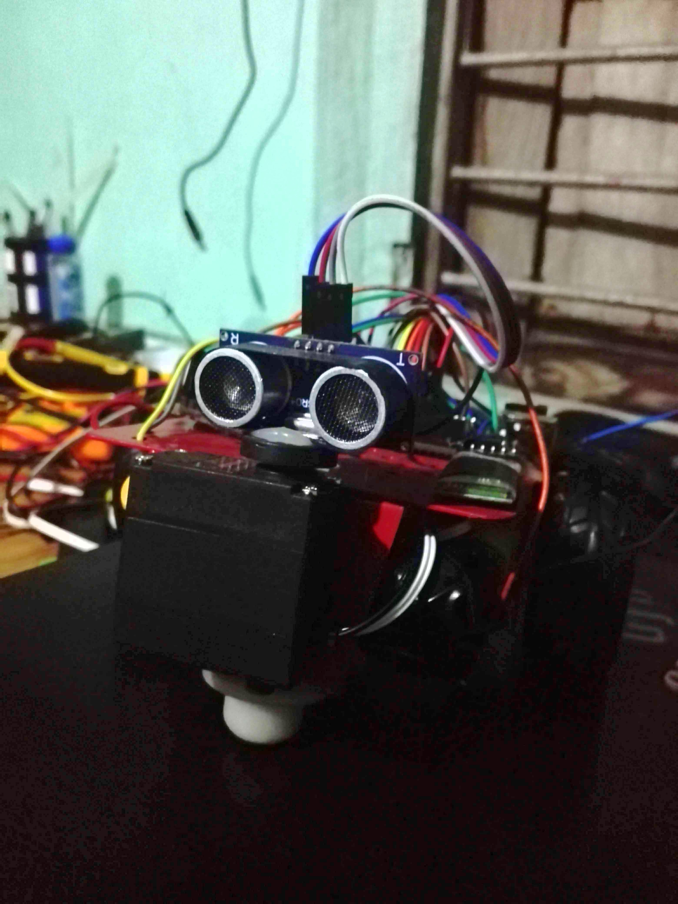
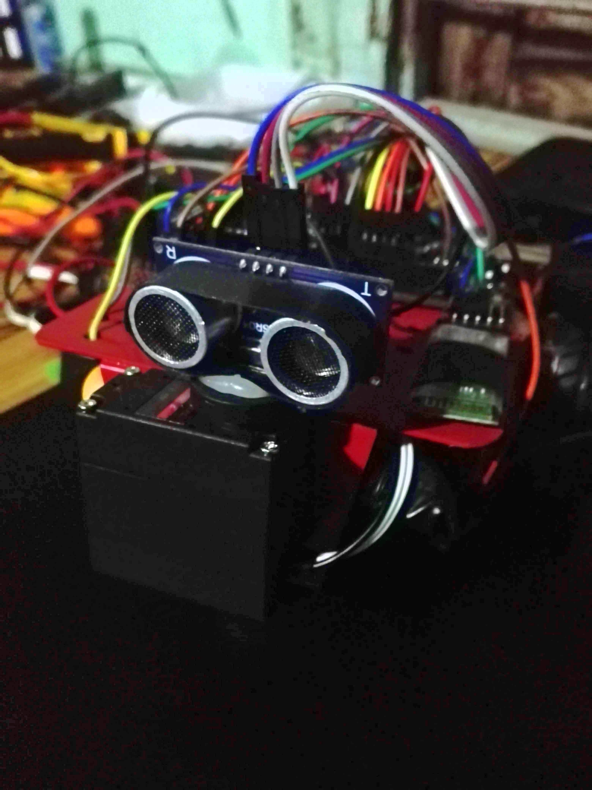

# Obstacle-Avoiding-Bot-With-Radar

Obstacle-Avoiding-Bot-With-Radar is a simple Arduino-based bot, it uses ultrasonic sensor combined with servo motor to act as an ultrasonic radar. It can be controlled manually using Bluetooth or can run on its own avoiding obstacles by using the radar. 
## Components Used

1. Arduino Uno
2. Ultrasonic Sensor HC-SR04
3. Servo Motor
4. Bluetooth module HC-05
5. Motor Driver L298N
6. BO motor *2
7. Caster wheel
8. LiPo battery

## Images

   

   

## Working

The connections are made as shown in the above figure. Ultrasonic sensor and IR sensors are used for obstacle and surface detection respectively. A power bank of 5v is used as a power supply that powers the Arduino and motor driver.  Input from sensors are taken and according to those values vehicle either moves forward or backward or rotates right. The IR sensor returns LOW if it detects the surface, using that info the bot first checks if it is on a surface and then it tries to avoid the obstacle with the help of proximity data provided by the Ultrasonic sensor. L298N H-bridge motor driver is used for motor control (doesn't match with the schematic as the component is not available in Tinkercad). The motor driver receives the control signal from Arduino and drives the motor as described in the code with the help of sensor data.